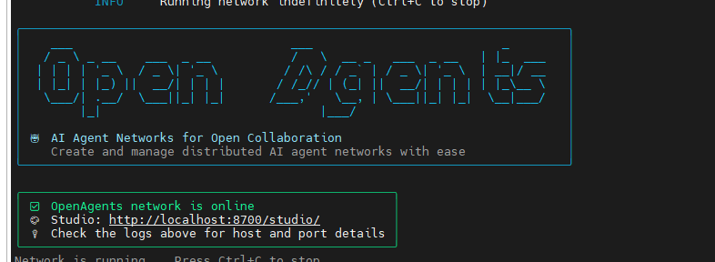

# java 面试房间

## 项目背景

当前 Java 技术岗位面试竞争日趋激烈，企业对 Java 专家及架构师的能力要求不断提升，面试官的考察维度也愈发全面、深入。对于候选人而言，缺乏真实面试场景的练习机会，往往难以精准把握考察重点、充分展现自身技术实力；而传统面试准备方式多为刷题、背知识点，无法模拟真实面试中的互动问答场景。基于此，我们开发了这套 Java 专家/架构师模拟面试智能体系统，为候选人提供高仿真的面试练习环境，助力其高效备战面试。

## 核心功能

本项目核心在于构建了一对具备专业交互能力的智能体——面试官智能体与面试者智能体，实现全流程模拟 Java 专家/架构师岗位面试：

1.  简历驱动个性化面试：支持候选人上传个人简历，面试官智能体将基于简历中的项目经验、技术栈等信息，定制针对性的面试问题，避免通用化提问，提升练习精准度；

2.  专业面试官智能提问：面试官智能体严格对标真实 Java 专家/架构师面试场景，围绕系统设计、Java 核心知识、中间件应用、问题排查等核心能力维度，进行结构化、层次化提问，并能针对候选人回答深挖技术细节；
3.  面试者智能应答交互：面试者智能体可模拟候选人身份，基于自身设定的技术能力模型，对面试官智能体的问题作出专业、贴合实际经验的回答，完整还原面试问答流程；
4.  高仿真面试场景还原：全程遵循真实面试的沟通逻辑与节奏，面试官智能体保持专业严谨的态度，面试者智能体展现真实的技术表达风格，为候选人提供沉浸式练习体验。

## 环境准备（以作者的为例, ubuntu 系统）

安装好 python3.14 环境
建立好一个虚拟环境
安装 openagents

将本项目拉到本地，并进入到目录
cd javaInterviewRoom
###

mv javaInterviewRoom interview

开 3 个终端， 都打开虚拟环境
都配置大模型相关的参数，

port OPENAI_BASE_URL=""

export OPENAI_API_KEY="我的 GLM api key"

export DEFAULT_LLM_MODEL_NAME=""

如我是使用 glm-4.6

eport OPENAI_BASE_URL="https://open.bigmodel.cn/api/paas/v4"

export OPENAI_API_KEY="我的 GLM api key"

export DEFAULT_LLM_MODEL_NAME="glm-4.6"

## 开启网络

回到 interview 的上一层目录
执行
openagents network start interview
最终会有如下界面 ， 说明 OK

现在可以通过浏览器打开 studio 和 mcp:

- **http://localhost:8700/studio/** - Studio web interface

## 分别在另外 2 个 terminal 启动 2 个智能体 interviewer 和 interviewee

另外两个 ternimal 都进入到 目录 interview/agents 下 ,分别执行如下命令

openagents agent start interviewee.yaml

openagents agent start interviewer.yaml
